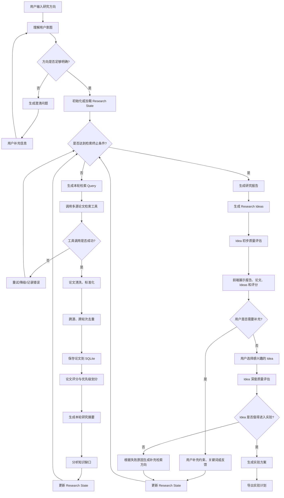

# Deep Research

基于 AI Agent 的自动化研究助手：输入研究方向，自动完成多源论文检索、评分、报告生成、Research Ideas 提出和实验方案设计。

## 系统流程图



## 技术栈

| 层 | 选型 |
|----|------|
| 后端框架 | FastAPI (Python 3.11+) |
| 数据库 | SQLite |
| ORM | SQLAlchemy 2.0 |
| LLM | 多 provider 可切换，默认 Venus LLM Proxy（兼容 OpenAI API，模型 gpt-4o-2024-11-20） |
| 论文数据源 | Semantic Scholar + arXiv + OpenAlex + Crossref + IEEE + CORE |
| 前端 | Vite + React + TypeScript + Tailwind CSS |
| Agent 架构 | 轻量自研 Loop（不依赖 LangGraph） |

## 核心参数

| 参数 | 默认值 |
|------|--------|
| 最大检索轮数 | 5 轮 |
| 每轮生成 Query 数 | 3-5 个 |
| 每源每 Query 返回论文数 | 15 篇 |
| Idea 生成数量 | 5-8 个 |
| 实验方案输出格式 | Markdown + JSON 双格式 |

## 终止条件（满足任一即停止）

1. 当前轮数 >= `max_rounds`（默认 5）
2. 高优先级论文数量 >= 目标数量（默认 15，可配置）
3. 当前轮数 >= 2 且最近一轮新增高优先级论文数 == 0
4. 连续 2 轮新增论文重复率 > 0.75
5. 用户手动停止

## 工具调用失败策略

| 场景 | 处理 |
|------|------|
| 单个数据源失败 | 记录错误并跳过该源，继续其他数据源 |
| 全部数据源失败 | 本轮重试一次 |
| 重试后仍失败 | 任务标记为 `failed`，等待用户重新启动或修改配置 |
| LLM 调用失败 | 重试 3 次（指数退避），仍失败则标记本轮为 `failed` |

## 项目结构

```
deep-research/
├── README.md
├── .env.example
├── docker-compose.yml
│
├── backend/
│   ├── requirements.txt
│   ├── app/
│   │   ├── __init__.py
│   │   ├── main.py                  # FastAPI 入口
│   │   ├── config.py                # 配置管理（环境变量）
│   │   │
│   │   ├── api/
│   │   │   ├── __init__.py
│   │   │   ├── deps.py              # 依赖注入
│   │   │   └── routes/
│   │   │       ├── __init__.py
│   │   │       ├── tasks.py         # 研究任务 CRUD + 启动
│   │   │       ├── papers.py        # 论文查询
│   │   │       ├── reports.py       # 报告查询
│   │   │       ├── ideas.py         # Idea 查询 + 用户选择
│   │   │       ├── experiments.py   # 实验方案查询/导出
│   │   │       └── events.py        # SSE 实时进度推送
│   │   │
│   │   ├── agent/
│   │   │   ├── __init__.py
│   │   │   ├── runner.py            # Agent Loop 主调度（精简版，仅编排逻辑）
│   │   │   ├── state.py             # ResearchState 数据结构
│   │   │   ├── policy.py             # 终止条件判断
│   │   │   ├── prompts.py           # 所有 LLM prompt 模板
│   │   │   └── steps/               # 各步骤独立模块（可单测）
│   │   │       ├── __init__.py
│   │   │       ├── clarify_topic.py    # 方向澄清
│   │   │       ├── generate_queries.py # 生成检索 Query
│   │   │       ├── search_papers.py    # 多源检索 + 去重 + 保存
│   │   │       ├── score_papers.py    # 评分（含 authority 调整）
│   │   │       ├── summarize_round.py # 轮次摘要 + 知识缺口
│   │   │       ├── build_clusters.py  # 论文聚类（Wiki 优先，LLM 兜底）
│   │   │       ├── generate_report.py # 报告生成（STORM 两步式）
│   │   │       ├── generate_ideas.py  # Idea 生成 + 5层验证
│   │   │       └── generate_experiment.py # 实验方案 + 深评
│   │   │
│   │   ├── llm/
│   │   │   ├── __init__.py
│   │   │   ├── base.py              # LLMProvider 抽象基类
│   │   │   ├── venus_provider.py    # Venus LLM Proxy（默认，兼容 OpenAI API）
│   │   │   ├── openai_provider.py    # OpenAI 直连（备用）
│   │   │   ├── deepseek_provider.py  # DeepSeek（预留）
│   │   │   ├── claude_provider.py    # Claude（预留）
│   │   │   └── factory.py           # Provider 工厂
│   │   │
│   │   ├── paper_sources/
│   │   │   ├── __init__.py
│   │   │   ├── base.py              # PaperSource 抽象基类
│   │   │   ├── semantic_scholar.py
│   │   │   ├── arxiv.py
│   │   │   ├── openalex.py
│   │   │   └── crossref.py
│   │   │
│   │   ├── db/
│   │   │   ├── __init__.py
│   │   │   ├── session.py           # engine + session
│   │   │   ├── models.py            # SQLAlchemy 模型
│   │   │   └── repositories/
│   │   │       ├── __init__.py
│   │   │       ├── task_repo.py
│   │   │       ├── paper_repo.py
│   │   │       ├── round_repo.py
│   │   │       ├── report_repo.py
│   │   │       ├── idea_repo.py
│   │   │       └── trace_repo.py
│   │   │
│   │   ├── schemas/                 # Pydantic 请求/响应模型
│   │   │   ├── __init__.py
│   │   │   ├── task.py
│   │   │   ├── paper.py
│   │   │   ├── report.py
│   │   │   ├── idea.py
│   │   │   └── experiment.py
│   │   │
│   │   └── services/
│   │       ├── __init__.py
│   │       ├── llm_service.py        # LLM 调用封装
│   │       ├── search_service.py     # 多源检索调度
│   │       ├── scoring_service.py   # 论文评分
│   │       └── event_service.py     # SSE 事件推送
│   │
│   ├── tests/
│   │   ├── __init__.py
│   │   ├── test_agent.py
│   │   ├── test_sources.py
│   │   └── test_api.py
│   │
│   └── alembic/                     # 数据库迁移（可选）
│
└── frontend/
    ├── package.json
    ├── vite.config.ts
    ├── tailwind.config.js
    ├── index.html
    └── src/
        ├── main.tsx
        ├── App.tsx
        ├── api/
        │   └── client.ts            # API 请求封装
        ├── types/
        │   └── index.ts             # TypeScript 类型定义
        ├── hooks/
        │   ├── useTask.ts           # 任务管理
        │   └── useSSE.ts             # SSE 实时进度
        ├── pages/
        │   ├── Home.tsx             # 输入研究方向
        │   └── ResearchDetail.tsx   # 研究详情主页面
        └── components/
            ├── TaskStatus.tsx       # 顶部任务状态
            ├── AgentTrace.tsx       # 左侧 Agent 执行轨迹
            ├── PaperList.tsx        # 论文列表
            ├── ReportView.tsx       # 报告展示
            ├── IdeaList.tsx         # Idea 列表 + 评分
            └── ExperimentPlan.tsx   # 实验方案展示
```

## 数据库表设计

### `research_tasks` — 研究任务

| 字段 | 类型 | 说明 |
|------|------|------|
| id | TEXT PK | UUID |
| user_input | TEXT | 用户原始输入 |
| normalized_topic | TEXT | 标准化研究方向 |
| status | TEXT | 见下方状态枚举 |
| current_round | INT | 当前轮次 |
| max_rounds | INT | 最大轮次（默认 5） |
| stop_reason | TEXT | 终止原因 |
| state_json | TEXT | Research State 完整序列化（used_queries、knowledge_gaps、keywords 等） |
| created_at | TIMESTAMP | |
| updated_at | TIMESTAMP | |

### 任务状态枚举

```
pending                       # 已创建，未启动
clarifying                    # 正在分析方向是否明确
waiting_for_clarification     # 等待用户回答澄清问题
searching                     # 检索循环中
summarizing                   # 生成本轮摘要
reporting                     # 生成研究报告
generating_ideas              # 生成 Research Ideas
waiting_for_user_review       # 等待用户查看报告/Ideas 并反馈
judging_ideas                 # 深度评估用户选中的 Ideas
generating_experiment          # 生成实验方案
done                          # 完成
stopped                       # 用户手动停止
failed                        # 执行失败
```

> 其中 `waiting_for_clarification` 和 `waiting_for_user_review` 需要前端等待用户操作。

### `papers` — 全局论文表

| 字段 | 类型 | 说明 |
|------|------|------|
| id | TEXT PK | UUID |
| title | TEXT | |
| abstract | TEXT | |
| authors_json | TEXT | JSON 数组 |
| year | INT | |
| venue | TEXT | |
| doi | TEXT | |
| arxiv_id | TEXT | |
| semantic_scholar_id | TEXT | |
| openalex_id | TEXT | |
| url | TEXT | |
| pdf_url | TEXT | |
| citation_count | INT | |
| sources_json | TEXT | 来源列表，如 `["semantic_scholar","openalex"]` |
| raw_json | TEXT | 各来源原始数据合并 |
| normalized_title | TEXT | 标准化标题（小写去空格） |
| title_hash | TEXT | 标题 SHA-256（用于快速去重） |
| created_at | TIMESTAMP | |

### `task_papers` — 任务-论文关联（含评分）

| 字段 | 类型 | 说明 |
|------|------|------|
| id | TEXT PK | |
| task_id | TEXT FK | |
| paper_id | TEXT FK | |
| discovered_round | INT | 在第几轮发现的 |
| relevance_score | FLOAT | 相关性 0-1 |
| authority_score | FLOAT | 权威性 0-1 |
| recency_score | FLOAT | 时效性 0-1 |
| novelty_score | FLOAT | 新颖性 0-1 |
| idea_potential_score | FLOAT | Idea 潜力 0-1 |
| final_score | FLOAT | 综合评分 |
| priority | TEXT | high / medium / low |
| reason | TEXT | 评分理由 |
| summary | TEXT | 单篇摘要 |
| created_at | TIMESTAMP | |

### `research_rounds` — 检索轮次记录

| 字段 | 类型 | 说明 |
|------|------|------|
| id | TEXT PK | |
| task_id | TEXT FK | |
| round_number | INT | |
| queries_json | TEXT | 本轮使用的 query 列表 |
| papers_found | INT | 本轮找到的论文数 |
| new_papers | INT | 去重后新增的论文数 |
| duplicate_rate | FLOAT | 重复率 |
| summary | TEXT | 本轮研究摘要 |
| knowledge_gaps_json | TEXT | 知识缺口 JSON |
| created_at | TIMESTAMP | |

### `reports` — 研究报告

| 字段 | 类型 | 说明 |
|------|------|------|
| id | TEXT PK | |
| task_id | TEXT FK | |
| content_markdown | TEXT | Markdown 报告内容 |
| content_json | TEXT | 结构化 JSON（可选） |
| created_at | TIMESTAMP | |

### `research_ideas` — 研究想法

| 字段 | 类型 | 说明 |
|------|------|------|
| id | TEXT PK | |
| task_id | TEXT FK | |
| title | TEXT | |
| description | TEXT | |
| motivation | TEXT | |
| method_sketch | TEXT | |
| expected_contribution | TEXT | |
| novelty | FLOAT | 0-1 |
| feasibility | FLOAT | 0-1 |
| significance | FLOAT | 学术研究意义 0-1 |
| evidence_support | FLOAT | 论文证据支撑程度 0-1 |
| differentiation | FLOAT | 与已有工作差异程度 0-1 |
| experimentability | FLOAT | 是否容易设计实验验证 0-1 |
| potential_impact | FLOAT | 潜在影响范围（工程/产业/开源） 0-1 |
| risk | FLOAT | 0-1 |
| final_score | FLOAT | 综合评分 |
| decision | TEXT | go / revise / reject |
| related_paper_ids_json | TEXT | 关联论文 ID 列表 |
| user_selected | BOOL | 用户是否选择 |
| created_at | TIMESTAMP | |

### `experiment_plans` — 实验方案

| 字段 | 类型 | 说明 |
|------|------|------|
| id | TEXT PK | |
| task_id | TEXT FK | |
| idea_id | TEXT FK | |
| hypothesis | TEXT | |
| dataset | TEXT | |
| baselines | TEXT | |
| metrics | TEXT | |
| steps_markdown | TEXT | Markdown 步骤 |
| steps_json | TEXT | JSON 步骤 |
| risks | TEXT | |
| created_at | TIMESTAMP | |

### `agent_traces` — Agent 执行轨迹

| 字段 | 类型 | 说明 |
|------|------|------|
| id | TEXT PK | |
| task_id | TEXT FK | |
| step_name | TEXT | 步骤名 |
| step_type | TEXT | action / observation / decision |
| round_number | INT | |
| input_json | TEXT | |
| output_json | TEXT | |
| llm_tokens_used | INT | |
| duration_ms | INT | |
| created_at | TIMESTAMP | |

### `user_feedbacks` — 用户反馈记录

| 字段 | 类型 | 说明 |
|------|------|------|
| id | TEXT PK | UUID |
| task_id | TEXT FK | 任务 ID |
| feedback_type | TEXT | clarification / research_feedback / idea_selection / experiment_feedback |
| content | TEXT | 用户反馈内容 |
| selected_idea_ids_json | TEXT | 用户选择的 Idea ID 列表 |
| need_more_research | BOOL | 是否需要补充检索 |
| created_at | TIMESTAMP | |

## 唯一约束与索引

```sql
-- papers: 部分唯一索引（仅对非 NULL 值约束）
CREATE UNIQUE INDEX idx_papers_doi ON papers(doi) WHERE doi IS NOT NULL;
CREATE UNIQUE INDEX idx_papers_arxiv ON papers(arxiv_id) WHERE arxiv_id IS NOT NULL;
CREATE UNIQUE INDEX idx_papers_s2 ON papers(semantic_scholar_id) WHERE semantic_scholar_id IS NOT NULL;
CREATE UNIQUE INDEX idx_papers_openalex ON papers(openalex_id) WHERE openalex_id IS NOT NULL;

-- papers: 查询索引
CREATE INDEX idx_papers_title_hash ON papers(title_hash);
CREATE INDEX idx_papers_year ON papers(year);
CREATE INDEX idx_papers_citation ON papers(citation_count);

-- task_papers: 唯一约束
CREATE UNIQUE INDEX idx_task_papers ON task_papers(task_id, paper_id);

-- research_rounds: 唯一约束
CREATE UNIQUE INDEX idx_rounds ON research_rounds(task_id, round_number);
```

> SQLite 支持部分唯一索引（partial unique index），以上语法兼容 SQLite 3.8.0+。MVP 阶段也可以在 repository 层做去重兜底。

## 评分公式

### 论文评分

```
paper_score = 0.30 × relevance + 0.25 × authority + 0.15 × recency + 0.15 × novelty + 0.15 × idea_potential
```

> **authority 调整**：缺失元数据（无引用+无年份）打 0.7 折；顶会/顶刊（ICML/NeurIPS/ICLR/CVPR/ACL 等）加 0.1（上限 1.0）。

| 分数 | 优先级 |
|------|--------|
| >= 0.75 | high |
| 0.5 - 0.75 | medium |
| < 0.5 | low |

### Idea 评分

```
idea_score = 0.20 × novelty + 0.20 × feasibility + 0.20 × significance + 0.20 × evidence_support + 0.10 × differentiation + 0.10 × experimentability
final_score = idea_score - 0.08 × risk
```

> 另有验证惩罚：编造基线 -0.15/个（上限 -0.3），编造数据集 -0.05/个，指标-假设不匹配 -0.05/个，非新颖 -0.1。

| 分数 | 决策 |
|------|------|
| >= 0.70 | go |
| 0.50 - 0.70 | revise |
| < 0.50 | reject |

## 去重策略（优先级从高到低）

1. DOI
2. arXiv ID
3. Semantic Scholar ID
4. OpenAlex ID
5. 标题 hash（normalized_title 的 SHA-256）
6. 标题相似度（> 0.95 视为重复）

## API 端点

| 方法 | 路径 | 说明 |
|------|------|------|
| POST | `/api/tasks` | 创建研究任务 |
| GET | `/api/tasks` | 获取任务列表 |
| GET | `/api/tasks/{id}` | 获取任务详情（含 state_json） |
| POST | `/api/tasks/{id}/start` | 启动 Agent |
| POST | `/api/tasks/{id}/stop` | 手动停止任务 |
| POST | `/api/tasks/{id}/clarify` | 提交澄清回答 |
| POST | `/api/tasks/{id}/feedback` | 提交用户反馈（补充关键词/约束） |
| GET | `/api/tasks/{id}/papers` | 论文列表（支持分页、优先级筛选） |
| GET | `/api/tasks/{id}/rounds` | 获取检索轮次记录 |
| GET | `/api/tasks/{id}/report` | 获取研究报告 |
| GET | `/api/tasks/{id}/ideas` | 获取 Research Ideas |
| POST | `/api/tasks/{id}/ideas/select` | 用户选择感兴趣的 Ideas |
| POST | `/api/tasks/{id}/ideas/judge` | 对选中的 Ideas 做深度质量评估 |
| POST | `/api/tasks/{id}/experiments` | 生成实验方案 |
| GET | `/api/tasks/{id}/experiments` | 获取实验方案列表 |
| GET | `/api/tasks/{id}/experiments/{plan_id}/export` | 导出实验方案（Markdown/JSON） |
| GET | `/api/tasks/{id}/traces` | 获取 Agent 执行轨迹 |
| GET | `/api/tasks/{id}/events` | SSE 实时进度推送 |

## LLM Provider 架构

默认使用 Venus LLM Proxy（兼容 OpenAI API 格式），支持多 provider 切换。

```python
# 抽象基类
class LLMProvider(ABC):
    @abstractmethod
    async def chat(self, messages, response_format="text") -> str: ...

    @abstractmethod
    async def chat_json(self, messages, schema: type[BaseModel]) -> BaseModel: ...

# Venus Provider（默认，兼容 OpenAI API）
class VenusProvider(LLMProvider):
    # base_url = http://v2.open.venus.oa.com/llmproxy
    # token = ENV_VENUS_OPENAPI_SECRET_ID + "@4083"
    # model = gpt-4o-2024-11-20
    ...

# 工厂模式
class LLMFactory:
    @staticmethod
    def create(provider_name: str) -> LLMProvider:
        # venus / openai / deepseek / qwen / claude
        ...

# 配置切换
# .env: LLM_PROVIDER=venus
# 代码中: llm = LLMFactory.create(settings.llm_provider)
```

## 前端页面布局

```
┌─────────────────────────────────────────────────────────┐
│  Research Detail Page                                   │
├─────────────────────────────────────────────────────────┤
│  [任务状态] 阶段: searching | 轮次: 3/5 | 论文: 87 | 高优: 23 │
├──────────┬────────────────────────────┬─────────────────┤
│  Agent   │  [报告] [论文] [Ideas] [缺口] [实验]        │  用户反馈区     │
│  轨迹    │                                            │                │
│          │  Tab 内容区                                │  补充关键词     │
│  方向澄清 │                                            │  选择 Idea     │
│  第1轮   │                                            │  继续检索       │
│  第2轮   │                                            │  生成实验方案   │
│  第3轮   │                                            │  导出报告       │
│  报告生成 │                                            │                │
│  Idea生成 │                                            │                │
└──────────┴────────────────────────────┴─────────────────┘
```

## 环境变量

```env
# LLM Provider
LLM_PROVIDER=venus
# Venus LLM Proxy（兼容 OpenAI API 格式）
ENV_VENUS_OPENAPI_SECRET_ID=你的token
VENUS_LLM_PROXY_URL=http://v2.open.venus.oa.com/llmproxy
VENUS_LLM_MODEL=gpt-4o-2024-11-20

# OpenAI（备用 provider）
OPENAI_API_KEY=
OPENAI_BASE_URL=https://api.openai.com/v1
OPENAI_MODEL=gpt-4o

# 论文源 API Keys（可选，无 key 时走免费额度）
SEMANTIC_SCHOLAR_API_KEY=
OPENALEX_EMAIL=your@email.com

# Agent 参数
MAX_ROUNDS=5
QUERIES_PER_ROUND=5
PAPERS_PER_SOURCE_PER_QUERY=15
HIGH_PRIORITY_TARGET=15

# 数据库
DATABASE_URL=sqlite:///./deep_research.db

# 服务
HOST=0.0.0.0
PORT=8000

# 认证（P0-4：留空则禁用认证；生产环境务必设置）
# 设置后，POST/PUT/DELETE /api/tasks 请求需携带 X-API-Key 头
API_KEY=
```

## SQLite 配置

SQLite 需启用 WAL 模式以支持并发读写（后台 Agent 写入 + 前端查询 + SSE 读取）：

```python
# 初始化时执行
PRAGMA journal_mode=WAL;
PRAGMA busy_timeout=5000;

# SQLAlchemy engine 配置
engine = create_engine(
    DATABASE_URL,
    connect_args={"check_same_thread": False},
    pool_pre_ping=True,
)
```

> MVP 阶段可接受。如后续需多用户并发，建议迁移至 PostgreSQL。

## Agent Loop 伪代码

```python
async def run_task(task_id: str):
    state = load_or_create_state(task_id)

    # 1. 方向澄清
    clarity = await clarify_topic(state)
    if not clarity.is_clear:
        save_clarification_questions(task_id, clarity.questions)
        update_task_status(task_id, "waiting_for_clarification")
        return  # 等待用户回答后再次调用

    update_task_status(task_id, "searching")

    # 2. 检索 loop
    while True:
        stop, reason = should_stop(state)
        if stop:
            state.stop_reason = reason
            break

        state.current_round += 1
        update_task_status(task_id, "searching")

        queries = await generate_queries(state)
        candidates = await search_papers(queries)       # 多源并行
        papers = normalize_papers(candidates)
        papers = deduplicate_papers(papers, existing_ids=state.collected_paper_ids)

        saved = save_papers_and_links(task_id, papers, state.current_round)
        scored = await score_papers(state, saved)

        update_task_status(task_id, "summarizing")
        round_summary = await summarize_round(state, scored)
        gaps = await analyze_gaps(state, scored)

        update_state(state, queries, scored, round_summary, gaps)
        save_state(task_id, state)  # 持久化 state_json

    # 3. 报告和 Ideas
    update_task_status(task_id, "reporting")
    report = await generate_report(state)

    update_task_status(task_id, "generating_ideas")
    ideas = await generate_ideas(state)
    judged = await judge_ideas_initially(state, ideas)

    save_report(task_id, report)
    save_ideas(task_id, judged)

    update_task_status(task_id, "waiting_for_user_review")


async def generate_experiment_for_selected_ideas(task_id: str, idea_ids: list[str]):
    update_task_status(task_id, "judging_ideas")
    reviews = await judge_ideas_deeply(task_id, idea_ids)
    good_ideas = [r for r in reviews if r.decision == "go"]

    if not good_ideas:
        update_task_status(task_id, "waiting_for_user_review")
        return {"status": "need_more_research", "reason": "No selected idea is ready for experiment."}

    update_task_status(task_id, "generating_experiment")
    plans = await generate_experiment_plans(task_id, good_ideas)

    update_task_status(task_id, "done")
    return plans
```

## 开发计划

### P0: 工程化基础（已实现）

**目标**：解决架构臃肿、任务丢失、内存泄漏、无认证、无测试五大基础问题。

- [x] **拆分 `runner.py`**：1573 行单文件 → 精简至 ~430 行编排逻辑 + 9 个 `steps/` 独立模块（可单测）
- [x] **任务恢复机制**：进程重启时自动扫描 `searching`/`reporting` 等中间态任务，标记为 `failed`（`recover_interrupted_tasks()`）
- [x] **SSE 队列限界**：`asyncio.Queue(maxsize=200)`，满时丢最旧事件；任务终态后 10 秒自动清理队列
- [x] **API Key 认证**：`API_KEY` 环境变量控制，保护 `POST/PUT/DELETE /api/tasks`；留空则禁用（本地开发）
- [x] **核心测试**：65 个测试覆盖去重、评分公式、终止条件、Wiki 合并、SSE 队列（`pytest tests/`）

### MVP 0: 后端最小闭环

**目标**：后端 API + Agent Loop + 基础论文检索 → 跑通完整链路

- [ ] 项目初始化 + 依赖安装
- [ ] 数据库模型 + SQLite WAL 配置
- [ ] LLM Provider 抽象 + OpenAI 实现
- [ ] 论文源：Semantic Scholar + arXiv（先 2 个）
- [ ] Agent Runner + 各 Step 实现
- [ ] 论文评分 + 跨轮次去重
- [ ] 报告 + Idea 生成 + 初评
- [ ] 基础 REST API（tasks / papers / report / ideas）
- [ ] asyncio task registry 启动 Agent

**暂不做**：OpenAlex、Crossref、SSE、前端、Idea 深评、实验方案

### MVP 1: 补充完整体验

- [ ] 接入 OpenAlex + Crossref
- [ ] SSE 实时进度推送
- [ ] React 前端（Vite + TypeScript + Tailwind）
- [ ] 用户反馈 API
- [ ] Idea 深度评估
- [ ] 实验方案生成 + 导出

### MVP 2: 增强质量

- [ ] PDF 全文解析（可选）
- [ ] Citation graph 扩展
- [ ] Embedding 向量检索
- [ ] 报告引用校验
- [ ] 多 LLM Provider 支持
- [ ] PostgreSQL 迁移（如需多用户）

## MVP 非目标

第一版暂不支持：

1. PDF 全文下载和解析（只用 title + abstract + citation metadata）
2. 自动运行真实实验（只生成实验方案文档）
3. 多用户权限系统
4. Google Scholar 抓取（无官方稳定 API）
5. 引用网络深度扩展（引用论文/被引用论文的递归检索）
6. 向量数据库 / Embedding 检索
7. LangGraph / AutoGen 等重型 Agent 框架
