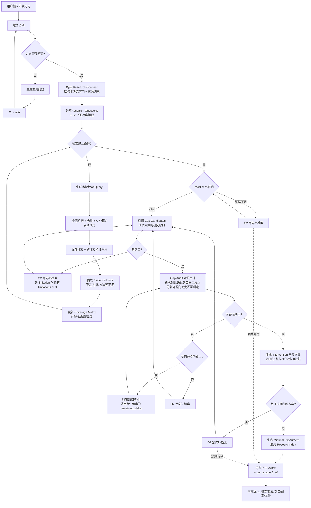

# Deep Research

基于 AI Agent 的证据驱动研究助手：输入研究方向，自动完成研究契约构建、多源论文检索、证据抽取、覆盖度分析、研究缺口挖掘与对抗审计、干预方案生成、以及最小实验设计。

系统的核心目标是**对抗 LLM 幻觉**——不再"检索完让 LLM 凭空编Idea"，而是让每一个研究缺口和研究想法都可回溯到具体论文证据，并通过独立的审计闸门验证。系统允许"零可信 Idea"的诚实结论，任何情况下都至少交付一份领域态势简报（Landscape Brief）。

## 系统流程图（Pipeline V2：证据驱动）



> 图中 O2/O7 为链路优化引入的能力：O2 定向补检索回环让闸门失败时自动补检索重试而非直接终止；O7 在入库前按主题相似度过滤离题论文。所有终止路径都会产出 Landscape Brief。

## 快速开始

```bash
# 1. 配置：复制 .env.example 到项目根目录的 .env，至少填好 LLM 端点与 Embedding
cp .env.example .env

# 2. 后端
cd backend
pip install -r requirements.txt
python -m alembic upgrade head          # 建库 / 升级到最新迁移
python -m uvicorn app.main:app --host 0.0.0.0 --port 8000

# 3. 前端（另开一个终端）
cd frontend
npm install
npm run dev

# 4. 测试
cd backend && python -m pytest -q
```

发起一次研究：`POST /api/tasks`（body 含研究方向），再 `POST /api/tasks/{id}/start`。任务终态为 `more_research_required` 时可直接再次 `start` 续跑，已入库的论文与证据会被复用。

> 单次完整运行约 20-60 分钟，主要花在证据抽取与外部检索上；`AGENT_TIMEOUT_SECONDS` 需留足（默认配置为 10800）。进度增量提交，超时或中断都可续跑。

## 技术栈

| 层 | 选型 |
|----|------|
| 后端框架 | FastAPI (Python 3.11+) |
| 数据库 | SQLite（WAL）+ Alembic 迁移 |
| ORM | SQLAlchemy 2.0 |
| LLM | 多 provider 可切换；主模型 Qwen3.5-397B-A17B + 备用 Qwen3.6-35B-A3B（FallbackLLMProvider 自动降级，OpenAI 兼容端点，40960 上下文） |
| 论文数据源 | Semantic Scholar + arXiv + OpenAlex + Crossref + Unpaywall + CORE + IEEE（无 key 时走免费额度） |
| 向量检索 | ChromaDB + 可插拔 Embedding 后端（当前用 DashScope `text-embedding-v4` / 1024 维，绕开本地 PyTorch） |
| 前端 | Vite + React + TypeScript + Tailwind CSS |
| Agent 架构 |轻量自研 Loop（不依赖 LangGraph） |

## 核心参数

| 参数 | 默认值 | 说明 |
|------|--------|------|
| 最大检索轮数 | 5 轮（当前 .env 设为 3） | |
| 每轮生成 Query 数 | 3-5 个 | |
| 每源每 Query 返回论文数 | 15 篇 | |
| 研究问题分解数量 | 5-12 个 | |
| 每轮抽取证据的论文数 | 30 篇（当前 .env 设为 15） | 抽取是单轮耗时主体，约 50s/篇 |
| 每篇论文送入 LLM 的 chunk 数 | 6 | 按 section 轮转分配，见「证据供给」 |
| LLM 上下文 / 预留输出 | 40960 / 4096 tokens | 输入准入上限 = 两者之差再留 512 余量 |
| Gap 挖掘注入证据上限 | 每问题 8 条 / 每问题内每论文 2 条 / 全局 40 条 | prompt 规模必须与轮次无关 |
| Gap 收窄次数上限 | 单 Gap 2 次 | |
| O2 定向补检索：每原因上限 | 2 次 | |
| O2 定向补检索：全局轮数上限 | 3 轮 | |
| O7 相似度预过滤阈值 | 0.45（无摘要论文 0.55） | 从 0.35 上调：实测 401 篇有 77% 落入 low 噪声 |
| 评分批内校准最小批量 | 5 篇 | |
| 实验方案输出格式 | Markdown + JSON 双格式 | |

## 终止条件（满足任一即停止）

1. 当前轮数 >= `max_rounds`（默认 5）
2. 高优先级论文数量 >= 目标数量（默认 15，可配置）
3. 当前轮数 >= 2 且最近一轮新增高优先级论文数 == 0
4. 连续 2 轮新增论文重复率 > 0.75
5. 用户手动停止

## 工具调用失败策略

| 场景 | 处理 |
|------|------|
| 单个数据源失败 | 记录错误并跳过该源，继续其他数据源 |
| 数据源返回 429 | 交给源级 cooldown 接管，不做短间隔退避重试（限流通常是出口 IP 级别的，重试只会加剧） |
| 全部数据源失败 | 本轮重试一次 |
| 重试后仍失败 | 任务标记为 `failed`，等待用户重新启动或修改配置 |
| LLM 调用失败（可重试） | 重试 3 次（指数退避） |
| LLM 主模型故障（transport/服务错误） | `FallbackLLMProvider` 自动切到备用模型（Qwen3.6-35B-A3B）；确定性错误（超预算/超上下文）不降级 |
| LLM 返回非法 JSON | 追加一次纠正轮次；只回显 400 字符摘录，保证重试请求不大于首轮 |
| LLM prompt 超出上下文 | 抛 `LLMContextOverflow`（与"服务故障"区分），由调用方缩小输入 |
| 检索循环失败但已完成 ≥1 轮 | 降级为 `more_research_required` 并保留已完成轮次的检索/证据/覆盖度，照常产出 Landscape Brief（不再作废整轮成果） |
| Gap 挖掘阶段失败 | 降级为 `more_research_required` 并照常产出 Landscape Brief，已完成的检索/证据/覆盖度全部保留、可续跑 |
| 单个 Gap 的审计决策非法 | 只废弃该条决策，其余 Gap 的结论保留（失败粒度与输出粒度对齐） |

## LLM 请求预算与上下文管理

本地部署的上下文窗口是硬约束（40960），且后端在两种情况下都只回一个笼统的 400：输入本身过长，或 `输入 + max_tokens` 超过窗口。以下机制保证 prompt 规模与轮次无关、且失败可归因：

- **输入准入**：发送前按字符估算 prompt 规模，超过 `上下文 - 预留输出 - 512` 即拒绝并抛 `LLMContextOverflow`，而不是等一个无法归因的 400。
- **估算自校准**：字符估算没有单一正确除数（UUID 密集文本实测约 1.8 字符/token，散文约 4），因此用后端返回的 `usage.prompt_tokens` 持续校准比值，取最坏近期观测并缓慢衰减；后端拒绝时还会从报错里的实测 prompt 规模反向校准。
- **输出额度**：`LLM_MAX_OUTPUT_TOKENS` 是准入时预留的**下限**而非上限。短 prompt 会按「上下文 − prompt 上界」申请更大的输出额度（报告类输出远超 4k tokens），且该上界按估算 ×1.5 + 2048 计算——因为后端拒绝 `输入 + max_tokens > 上下文`，用估算值直接计算会在估算偏低时越界。
- **额度自愈**：若因 `输入 + max_tokens` 超限被拒，先用预留下限重发一次（额度是本系统自己选的，不该让某个阶段为此失败），prompt 本身过大才上报。
- **注入有界**：凡是"把某张表的全部行拼进 prompt"的步骤都必须有界。Gap 挖掘按每问题/每论文/全局三层上限选取证据，并在问题之间轮转，使全局上限截断长尾而不是让整个问题从 prompt 中消失；校验引用时只认实际注入的证据 ID，否则模型引用一个从未展示过的 ID 会与凭空编造无法区分。

## 证据供给与关系语义

Gap 能否挖出来，取决于抽取阶段是否供给了准入所需的证据类型：

- **chunk 预算按 section 轮转**：每篇论文 6 个 chunk 的预算在各 section 间轮转分配（conclusion 优先级最高），而不是按 section 全局排序后截断。PDF 解析把 Discussion / Limitations / Threats to Validity / Future Work 都归入 `conclusion`，而 Gap 准入要求每个研究问题至少有一条局限性信号；按全局优先级排序时，长 method 段会吃满整篇论文的预算，实测导致 conclusion 段一条证据都进不了模型。
- **section 提示**：conclusion 段要求把边界、失败条件、未测设定标为 `limitation` / `negative_result`；method / experiment 段要求记录实际评估的设定、数据集、基线，以及**文本中明确写出**的限制，并禁止推断文本未陈述的内容（span 定位校验是硬保障）。
- **supporting 语义单一来源**：`app/agent/evidence_relations.py` 统一定义哪些 `relation_type` 算证实（`supports`、`partially_answers`）、哪些算反证，以及 0.5 的最低相关性门槛，覆盖度与 Gap 挖掘共用。此前两者定义不一致（覆盖度只认 `supports`，把 `partially_answers` 当背景），而匹配 prompt 恰恰把 `partially_answers` 定义为"部分回答/指出局限"、兜底启发式又把每条 `limitation` 映射到它——实测同一批证据在覆盖度侧算 0.15、在挖掘侧却可准入。

## Gap 生命周期

```
candidate → auditing → confirmed → surviving        # 通过对抗审计，进入下游
                    ↘ partially_closed → audited    # 被近邻部分覆盖，收窄后重审
                    ↘ closed → rejected             # 已被现有工作覆盖
```

- **收窄**（`steps/narrow_gaps.py`）：采用审计给出的 remaining_delta 作为新的 claimed_delta，把近邻已覆盖的内容并入 existing_coverage，回到 auditing 重新争取 confirmed；不调用 LLM，无具体 delta 则不收窄，单 Gap 上限 2 次（全局 `MAX_NARROWING_PASSES_TOTAL=3`）。
- **只重审有新输入的 Gap**：收窄只改写一个 Gap 的主张，因此下一轮审计只判定被收窄的那些。重审一个输入未变的 Gap 会用同样的对抗 query 得到同样的结论。
- **不可判定终结**：若上一次已判定的审计要求 `more_search`，而本轮的 claim 与近邻集合完全未变，说明这个诉求无法被满足（例如外部检索源被限流、拿不到任何新对照），该 Gap 直接关闭为不可判定（`audit_result` 保持 `uncertain`，`rejection_reason` 记 `novelty_undecidable`），不再消耗预算。它会作为"未获证实"被如实记录，而不是被静默丢弃。
- **remediation 后复审而非重新挖掘**：定向补检索加入新证据后，evidence fingerprint 变化会让 mining 幂等失效。此时若直接重新 mining，会生成与旧 Gap 语义重复的新候选（措辞变体）并重复消耗审计预算。因此 remediation 轮优先把上一轮未决 Gap（`auditing` / `audited` / `inconclusive` 状态）置回 `candidate` 直接复审，只有 Gap 池全部闭合后才重新 mining。复审的 `audit_input_version` 包含 `remediation_round`，防止阶段幂等误判为相同输入。
- **surviving 是 contract 级终态**：survivor 查询不限定本轮 gap 列表——早前轮次确认的 Gap 在后续复审其他 Gap 的轮次中依然有效。mining 产出为空（新候选全部被判 `DUPLICATE_GAP` 拦截）时，已确认的 survivor 仍继续流向下游，而不是误判 `no_evidence_backed_gap_candidates` 终止任务。
- **对抗查询家族三级兜底**（`GAP_SEARCH_POLICY_VERSION` v10）：查询家族的变体验证失败不再直接丢弃家族——① raw 变体 ≥2 时降级接受（`LOW_CONFIDENCE_VARIANTS`）；② raw 变体为空但结构化 intent 完整时，由 `_synthesize_family_variants` 从 intent 的结构化字段（problem/mechanism/intervention 等）合成查询（`SYNTHESIZED_VARIANTS`；根因：pydantic `default_factory=list` 绕过 `min_length` 校验，LLM 返回空变体列表曾导致 4/5 家族被丢弃、准入必然失败）；③ 都不行才丢弃。审计流程内含两处 commit 检查点（搜索+评分后、相关性筛选后），超时回滚不再丢弃已完成的工作。
- **语义去重**（`GAP_MINING_POLICY_VERSION` v5）：新候选与已有 Gap 的嵌入余弦相似度 ≥ 0.78 判 `DUPLICATE_GAP`（v4 为 0.85，拦不住措辞变体）；同时 mining prompt 注入已有 Gap 的 claimed_delta 列表，要求不得重新提出已覆盖的主张。
- 审计规则或准入规则变更时必须递增 `GAP_MINING_POLICY_VERSION` / `GAP_SEARCH_POLICY_VERSION` / `EXPERIMENT_GENERATION_POLICY_VERSION`，否则续跑会命中阶段幂等直接复用旧结论。

## 项目结构

```
deep-research/
├── README.md
├── .env                             # 实际配置（不入库）
├── .env.example
│
├── backend/
│   ├── requirements.txt
│   ├── app/
│   │   ├── __init__.py
│   │   ├── main.py                  # FastAPI 入口
│   │   ├── config.py                # 配置管理（环境变量）
│   │   │
│   │   ├── api/
│   │   │   ├── __init__.py
│   │   │   ├── deps.py              # 依赖注入
│   │   │   └── routes/
│   │   │       ├── __init__.py
│   │   │       ├── tasks.py         # 研究任务 CRUD + 启动
│   │   │       ├── papers.py        # 论文查询
│   │   │       ├── reports.py       # 报告查询
│   │   │       ├── ideas.py         # Idea 查询 + 用户选择
│   │   │       ├── experiments.py   # 实验方案查询/导出
│   │   │       └── events.py        # SSE 实时进度推送
│   │   │
│   │   ├── agent/
│   │   │   ├── __init__.py
│   │   │   ├── runner.py            # Agent Loop 主调度（仅编排逻辑）
│   │   │   ├── state.py             # ResearchState 数据结构
│   │   │   ├── policy.py             # 终止条件判断
│   │   │   ├── evidence_relations.py # supporting/反证关系与最低相关性的单一定义
│   │   │   ├── prompts.py           # 所有 LLM prompt 模板
│   │   │   └── steps/               # 各步骤独立模块（可单测）
│   │   │       ├── clarify_topic.py           # 方向澄清
│   │   │       ├── build_contract.py          # Research Contract（方向 + 资源约束）
│   │   │       ├── decompose_research_space.py # 分解 Research Questions
│   │   │       ├── generate_queries.py        # 生成检索 Query
│   │   │       ├── search_papers.py           # 多源检索 + 去重 + 保存
│   │   │       ├── score_papers.py            # 评分（含跨论文校准）
│   │   │       ├── summarize_round.py         # 轮次摘要
│   │   │       ├── extract_evidence.py        # 抽取 Evidence Units（section 轮转预算）
│   │   │       ├── update_coverage.py         # 问题-证据覆盖矩阵
│   │   │       ├── readiness_gate.py          # 进入机会流水线的准入判定
│   │   │       ├── mine_gaps.py               # 挖掘 Gap Candidates（证据注入有界）
│   │   │       ├── audit_gaps.py              # 对抗审计（近邻对比 / 不可判定终结）
│   │   │       ├── narrow_gaps.py             # 收窄 partially_closed 的 Gap
│   │   │       ├── targeted_research.py       # O2 定向补检索
│   │   │       ├── generate_interventions.py  # 干预方案 + 可行性硬闸门
│   │   │       ├── generate_minimal_experiments.py # 最小实验方案
│   │   │       ├── generate_landscape_brief.py # 领域态势简报（所有终止路径）
│   │   │       ├── analyze_papers.py          # PDF 全文分析
│   │   │       ├── build_clusters.py          # 论文聚类（Wiki 优先，LLM 兜底）
│   │   │       ├── generate_report.py         # 报告生成（STORM 两步式）
│   │   │       ├── generate_ideas.py          # Idea 生成（V1 链路保留）
│   │   │       └── generate_experiment.py     # 实验方案 + 深评（V1 链路保留）
│   │   │
│   │   ├── llm/
│   │   │   ├── __init__.py
│   │   │   ├── base.py              # LLMProvider 抽象基类
│   │   │   ├── venus_provider.py    # Venus LLM Proxy（默认，兼容 OpenAI API）
│   │   │   ├── openai_provider.py    # OpenAI 直连（备用）
│   │   │   ├── fallback_provider.py  # 主备模型自动降级（FallbackLLMProvider）
│   │   │   └── factory.py           # Provider 工厂
│   │   │
│   │   ├── paper_sources/
│   │   │   ├── __init__.py
│   │   │   ├── base.py              # PaperSource 抽象基类
│   │   │   ├── semantic_scholar.py
│   │   │   ├── arxiv.py
│   │   │   ├── openalex.py
│   │   │   ├── crossref.py
│   │   │   ├── unpaywall.py          # OA 全文链接（DOI → 免费 PDF）
│   │   │   ├── core.py              # CORE 全文
│   │   │   └── ieee.py              # IEEE Xplore（需 key，可留空跳过）
│   │   │
│   │   ├── db/
│   │   │   ├── __init__.py
│   │   │   ├── session.py           # engine + session
│   │   │   ├── models.py            # SQLAlchemy 模型
│   │   │   └── repositories/
│   │   │       ├── __init__.py
│   │   │       ├── task_repo.py
│   │   │       ├── paper_repo.py
│   │   │       ├── round_repo.py
│   │   │       ├── report_repo.py
│   │   │       ├── idea_repo.py
│   │   │       └── trace_repo.py
│   │   │
│   │   ├── schemas/                 # Pydantic 请求/响应模型
│   │   │   ├── __init__.py
│   │   │   ├── task.py
│   │   │   ├── paper.py
│   │   │   ├── report.py
│   │   │   ├── idea.py
│   │   │   └── experiment.py
│   │   │
│   │   └── services/
│   │       ├── __init__.py
│   │       ├── llm_service.py        # LLM 调用封装
│   │       ├── search_service.py     # 多源检索调度
│   │       ├── scoring_service.py   # 论文评分
│   │       └── event_service.py     # SSE 事件推送
│   │
│   ├── tests/                       # 263 个测试（pytest -q）
│   │
│   └── alembic_migrations/          # 数据库迁移（Alembic，0000 → 0019）
│
└── frontend/
    ├── package.json
    ├── vite.config.ts
    ├── tailwind.config.js
    ├── index.html
    └── src/
        ├── main.tsx
        ├── App.tsx
        ├── api/
        │   └── client.ts            # API 请求封装
        ├── types/
        │   └── index.ts             # TypeScript 类型定义
        ├── hooks/
        │   ├── useTask.ts           # 任务管理
        │   └── useSSE.ts             # SSE 实时进度
        ├── pages/
        │   ├── Home.tsx             # 输入研究方向
        │   └── ResearchDetail.tsx   # 研究详情主页面
        └── components/
            ├── TaskStatus.tsx       # 顶部任务状态
            ├── AgentTrace.tsx       # 左侧 Agent 执行轨迹
            ├── PaperList.tsx        # 论文列表
            ├── ReportView.tsx       # 报告展示
            ├── IdeaList.tsx         # Idea 列表 + 评分
            └── ExperimentPlan.tsx   # 实验方案展示
```

## 数据库表设计

### Pipeline V2 表一览

V2 的关键状态全部结构化落库，而不是塞进 `state_json`，这样每个结论都能回溯到证据、且续跑幂等：

| 表 | 作用 |
|----|------|
| `research_contracts` | 结构化研究方向 + 资源约束；按输入哈希幂等，改写方向会 supersede 旧版本 |
| `research_questions` | 由 Contract 分解出的 5-12 个可检索问题（含 importance / status） |
| `evidence_units` | 可回溯的证据单元：normalized_claim + 原文 span + chunk hash + 页码 + verification_status |
| `question_evidence_links` | 问题-证据关系（relation_type + relevance_score） |
| `coverage_records` | 每个问题的覆盖度快照（按贡献 supporting 证据的**不同论文数**驱动） |
| `gap_candidates` | 研究缺口候选（claimed_delta / existing_coverage / status / mining_policy_version） |
| `gap_evidence_links` | 缺口引用的证据（仅允许引用 prompt 实际展示过的证据） |
| `gap_audits` | 对抗审计记录（近邻、审计结论、recommended_action、audited_claimed_delta） |
| `neighbor_comparisons` | 缺口与近邻论文的逐篇对比，按 (gap_id, paper_id) upsert |
| `intervention_candidates` | 干预方案 + 三道硬闸门结果 + confidence_tier |
| `search_query_records` / `search_query_papers` | 每条检索 query 的执行记录与命中论文，审计的检索准入依赖它 |
| `phase_runs` | 阶段级幂等与重试记录（phase_name + input_version + status） |
| `paper_analyses` / `paper_chunks` / `paper_roles` / `paper_citations` | PDF 全文分析、RAG 分块、论文角色、引用关系 |
| `wiki_pages` | LLM Wiki 增量编译的 Markdown 页面 |

> `phase_runs.input_version` 必须包含「该阶段自身的策略版本 + 被判定对象的当前内容」。只写前者会导致规则改了却跳过阶段，只写后者会导致改了规则仍复用旧结论。

### `research_tasks` — 研究任务

| 字段 | 类型 | 说明 |
|------|------|------|
| id | TEXT PK | UUID |
| user_input | TEXT | 用户原始输入 |
| normalized_topic | TEXT | 标准化研究方向 |
| status | TEXT | 见下方状态枚举 |
| current_round | INT | 当前轮次 |
| max_rounds | INT | 最大轮次（默认 5） |
| stop_reason | TEXT | 终止原因 |
| state_json | TEXT | Research State 完整序列化（used_queries、knowledge_gaps、keywords 等） |
| created_at | TIMESTAMP | |
| updated_at | TIMESTAMP | |

### 任务状态枚举

```
pending                       # 已创建，未启动
clarifying                    # 正在分析方向是否明确
waiting_for_clarification     # 等待用户回答澄清问题
building_contract             # 构建 Research Contract（V2）
decomposing                   # 分解 Research Questions（V2）
searching                     # 检索循环中（含 O2 定向补检索）
summarizing                   # 生成本轮摘要
extracting_evidence           # 抽取 Evidence Units（V2）
updating_coverage             # 更新问题-证据覆盖矩阵（V2）
analyzing_papers              # PDF 全文分析
mining_gaps                   # 挖掘证据支撑的研究缺口（V2）
auditing_gaps                 # 对研究缺口做对抗审计（V2）
synthesizing_ideas            # 生成干预方案（V2）
generating_ideas              # 生成 Idea（V1 链路）
judging_ideas                 # Idea 深度评估
generating_experiment         # 生成最小实验方案
reporting                     # 生成研究报告
waiting_for_user_review       # 等待用户查看报告/缺口/创意并反馈
more_research_required        # 证据不足/无存活缺口，已产出 Landscape Brief（V2）
insufficient_evidence         # 证据不足以支撑任何缺口（V2）
abstained                     # 系统主动弃权，未产出可信 Idea（V2）
done                          # 完成
stopped                       # 用户手动停止
failed                        # 执行失败
```

> 其中 `waiting_for_clarification` 和 `waiting_for_user_review` 需要前端等待用户操作。

### `papers` — 全局论文表

| 字段 | 类型 | 说明 |
|------|------|------|
| id | TEXT PK | UUID |
| title | TEXT | |
| abstract | TEXT | |
| authors_json | TEXT | JSON 数组 |
| year | INT | |
| venue | TEXT | |
| doi | TEXT | |
| arxiv_id | TEXT | |
| semantic_scholar_id | TEXT | |
| openalex_id | TEXT | |
| url | TEXT | |
| pdf_url | TEXT | |
| citation_count | INT | |
| sources_json | TEXT | 来源列表，如 `["semantic_scholar","openalex"]` |
| raw_json | TEXT | 各来源原始数据合并 |
| normalized_title | TEXT | 标准化标题（小写去空格） |
| title_hash | TEXT | 标题 SHA-256（用于快速去重） |
| created_at | TIMESTAMP | |

### `task_papers` — 任务-论文关联（含评分）

| 字段 | 类型 | 说明 |
|------|------|------|
| id | TEXT PK | |
| task_id | TEXT FK | |
| paper_id | TEXT FK | |
| discovered_round | INT | 在第几轮发现的 |
| relevance_score | FLOAT | 相关性 0-1 |
| authority_score | FLOAT | 权威性 0-1 |
| recency_score | FLOAT | 时效性 0-1 |
| novelty_score | FLOAT | 新颖性 0-1 |
| idea_potential_score | FLOAT | Idea 潜力 0-1 |
| final_score | FLOAT | 综合评分 |
| priority | TEXT | high / medium / low |
| reason | TEXT | 评分理由 |
| summary | TEXT | 单篇摘要 |
| created_at | TIMESTAMP | |

### `research_rounds` — 检索轮次记录

| 字段 | 类型 | 说明 |
|------|------|------|
| id | TEXT PK | |
| task_id | TEXT FK | |
| round_number | INT | |
| queries_json | TEXT | 本轮使用的 query 列表 |
| papers_found | INT | 本轮找到的论文数 |
| new_papers | INT | 去重后新增的论文数 |
| duplicate_rate | FLOAT | 重复率 |
| summary | TEXT | 本轮研究摘要 |
| knowledge_gaps_json | TEXT | 知识缺口 JSON |
| created_at | TIMESTAMP | |

### `reports` — 研究报告

| 字段 | 类型 | 说明 |
|------|------|------|
| id | TEXT PK | |
| task_id | TEXT FK | |
| content_markdown | TEXT | Markdown 报告内容 |
| content_json | TEXT | 结构化 JSON（可选） |
| created_at | TIMESTAMP | |

### `research_ideas` — 研究想法

| 字段 | 类型 | 说明 |
|------|------|------|
| id | TEXT PK | |
| task_id | TEXT FK | |
| title | TEXT | |
| description | TEXT | |
| motivation | TEXT | |
| method_sketch | TEXT | |
| expected_contribution | TEXT | |
| novelty | FLOAT | 0-1 |
| feasibility | FLOAT | 0-1 |
| significance | FLOAT | 学术研究意义 0-1 |
| evidence_support | FLOAT | 论文证据支撑程度 0-1 |
| differentiation | FLOAT | 与已有工作差异程度 0-1 |
| experimentability | FLOAT | 是否容易设计实验验证 0-1 |
| potential_impact | FLOAT | 潜在影响范围（工程/产业/开源） 0-1 |
| risk | FLOAT | 0-1 |
| final_score | FLOAT | 综合评分 |
| decision | TEXT | V1: go / revise / reject；V2 四级: executable_candidate / conditional_review / research_direction_only / rejected（代码门禁定级，评分只排序） |
| related_paper_ids_json | TEXT | 关联论文 ID 列表 |
| user_selected | BOOL | 用户是否选择 |
| score_status | TEXT | pending / passed / failed（评分失败不再静默） |
| score_error | TEXT | 评分失败原因 |
| quality_reason_codes_json | TEXT | 质量门禁 reason codes（如 SCENARIO_MISMATCH、MISSING_DATASET_PROVENANCE） |
| variant_intervention_ids_json | TEXT | hypothesis cluster 门禁：并入本 Idea 消融臂的机制变体干预列表 |
| created_at | TIMESTAMP | |

### `experiment_plans` — 实验方案

| 字段 | 类型 | 说明 |
|------|------|------|
| id | TEXT PK | |
| task_id | TEXT FK | |
| idea_id | TEXT FK | |
| hypothesis | TEXT | |
| dataset | TEXT | |
| dataset_provenance | TEXT | 数据集来源与构造流程（防"需新构造却伪装现成"） |
| model_spec | TEXT | 模型规格（须与研究范围一致） |
| oracle | TEXT | 真值判定方式（LLM 不得作为唯一 oracle） |
| statistical_analysis | TEXT | 统计方法（二元配对数据应为 McNemar 等） |
| resource_budget | TEXT | 资源预算（GPU/时长） |
| scenario_atoms_json | TEXT | 场景原子（实验文本须逐字包含，防实验偏离研究范围） |
| baselines | TEXT | 对照组设计（含 cluster 变体消融臂） |
| metrics | TEXT | |
| steps_markdown | TEXT | Markdown 步骤 |
| steps_json | TEXT | JSON 步骤 |
| risks | TEXT | |
| created_at | TIMESTAMP | |

### `agent_traces` — Agent 执行轨迹

| 字段 | 类型 | 说明 |
|------|------|------|
| id | TEXT PK | |
| task_id | TEXT FK | |
| step_name | TEXT | 步骤名 |
| step_type | TEXT | action / observation / decision |
| round_number | INT | |
| input_json | TEXT | |
| output_json | TEXT | |
| llm_tokens_used | INT | |
| duration_ms | INT | |
| created_at | TIMESTAMP | |

### `user_feedbacks` — 用户反馈记录

| 字段 | 类型 | 说明 |
|------|------|------|
| id | TEXT PK | UUID |
| task_id | TEXT FK | 任务 ID |
| feedback_type | TEXT | clarification / research_feedback / idea_selection / experiment_feedback |
| content | TEXT | 用户反馈内容 |
| selected_idea_ids_json | TEXT | 用户选择的 Idea ID 列表 |
| need_more_research | BOOL | 是否需要补充检索 |
| created_at | TIMESTAMP | |

## 唯一约束与索引

```sql
-- papers: 部分唯一索引（仅对非 NULL 值约束）
CREATE UNIQUE INDEX idx_papers_doi ON papers(doi) WHERE doi IS NOT NULL;
CREATE UNIQUE INDEX idx_papers_arxiv ON papers(arxiv_id) WHERE arxiv_id IS NOT NULL;
CREATE UNIQUE INDEX idx_papers_s2 ON papers(semantic_scholar_id) WHERE semantic_scholar_id IS NOT NULL;
CREATE UNIQUE INDEX idx_papers_openalex ON papers(openalex_id) WHERE openalex_id IS NOT NULL;

-- papers: 查询索引
CREATE INDEX idx_papers_title_hash ON papers(title_hash);
CREATE INDEX idx_papers_year ON papers(year);
CREATE INDEX idx_papers_citation ON papers(citation_count);

-- task_papers: 唯一约束
CREATE UNIQUE INDEX idx_task_papers ON task_papers(task_id, paper_id);

-- research_rounds: 唯一约束
CREATE UNIQUE INDEX idx_rounds ON research_rounds(task_id, round_number);
```

> SQLite 支持部分唯一索引（partial unique index），以上语法兼容 SQLite 3.8.0+。MVP 阶段也可以在 repository 层做去重兜底。
>
> **enrichment 唯一索引守卫**（`services/metadata_enrichment.py`）：同一物理论文可能存在两行（如 OpenAlex 行与 S2 行，检索去重未合并时），S2 enrichment 会把 A 行的 DOI"补"给 B 行。pipeline 模式（共享 agent session）下该改动悬在事务中不提交，后续 flush 时触发 `IntegrityError(papers.doi)` 毒化整个任务。因此 enrichment 写入前对 4 个唯一索引字段逐一查重——值已被其他行占用则丢弃该字段（记 debug log）；写区段经 `write_lock` 串行化 + `no_autoflush` 防止并发悬置改动互相不可见；失败分支统一 rollback + expire 解毒。

## 评分公式

### 论文评分

```
paper_score = 0.25 × relevance + 0.30 × authority + 0.15 × recency + 0.15 × novelty + 0.15 × idea_potential
```

> **authority 调整**：缺失元数据（无引用+无年份）打 0.7 折；顶会/顶刊（ICML/NeurIPS/ICLR/CVPR/ACL 等）加 0.1（上限 1.0）。
>
> **跨论文校准**（本次优化）：单轮评分论文数 ≥ 5 时，对final_score 做批内校准 `adjusted = s + 0.15 × (s - batch_mean)`，把趋同的分数拉开区分度（历史上独立评分区分度仅约 0.05），批均值保持稳定，因此下方阈值仍适用。

| 分数 | 优先级 |
|------|--------|
| >= 0.75 | high |
| 0.5 - 0.75 | medium |
| < 0.5 | low |

### 研究缺口与干预方案的分级产出（Confidence Tier，本次优化）

Pipeline V2 不再"闸门不过就丢弃"，而是分级产出，让用户拿到按置信度排序的方向清单：

| 档位 | 含义 | 是否进入下游 |
|------|------|--------------|
| A | 通过全部硬闸门，且有可定位的全文证据支撑 | 是 |
| B | 无闸门硬失败，但存在待确认项（某闸门 UNKNOWN/WARN，或缺口仅摘要级证据） | 是 |
| C | 存在闸门硬失败，作为推测性方向保留 | 否（仅供参考） |

> **可行性闸门放宽**（本次优化）：方案顺口提到"训练/微调"不再一票否决淘汰；仅当核心方案确实依赖训练且 Contract 声明无 GPU 时才判FAIL，否则降级为 WARN（落入 B 档，仍可下游）。

### Idea 评分

```
idea_score = 0.20 × novelty + 0.20 × feasibility + 0.20 × significance + 0.20 × evidence_support + 0.10 × differentiation + 0.05 × experimentability + 0.05 × potential_impact
final_score = idea_score - 0.08 × risk
```

> 该 8 维打分与加权公式由 V1（`generate_ideas.py` 的 `_score_idea`）与 V2（`generate_minimal_experiments.py` 复用同一函数）共用。评分只用于排序，不作为放行门禁。
>
> V1 链路另有验证惩罚：编造基线 -0.15/个（上限 -0.3），编造数据集 -0.05/个，指标-假设不匹配 -0.05/个，非新颖 -0.1。

### Idea 四级分类（V2，代码门禁定级）

```
executable_candidate    # 硬门禁全过：所属干预 confidence_tier=A 且实验计划通过质量校验
conditional_review      # tier B/C，或实验计划被拒（含反馈重试后仍失败）、评分失败
research_direction_only # 仅方向性产出，无可执行实验载体
rejected                # 实验计划被质量门禁拒绝（trace 记录 reason_codes + 计划摘要）
```

系统允许产出 0 个 `executable_candidate`（证据不足时诚实拒绝优于生成不可靠产物）。E2E 实证（任务 23ec8f20）：最高分 idea（0.7435）因跨语言 benchmark 的实验载体不足被判 `conditional_review`，评分排序未越过硬门禁。

### Hypothesis cluster 门禁（`EXPERIMENT_GENERATION_POLICY_VERSION` = hypothesis-cluster-v2）

同一 Gap 的多个 passed intervention 在生成实验计划前先做一次 LLM 结构化聚簇（`_cluster_interventions_by_hypothesis`），判定标准是"检验的实验假设是否相同"（测什么）而非"机制是否相似"（怎么做）：

- 同簇只产出 1 个 Idea + 1 个实验计划，其余 intervention 作为机制变体并入该实验的 baselines 消融臂，并记录 `variant_intervention_ids` 供前端展示
- LLM 聚簇失败 / 任一簇 confidence < 0.7 / 出现未知 intervention id 时保守降级：不合并（每个 intervention 独立成簇），记 `hypothesis_cluster` trace
- 实验计划被质量校验拒绝后带 reason_codes 反馈重试一次（场景原子为字面子串匹配，如 "verification" 不满足原子 "verifier"，重试要求原子词逐字出现在 dataset/oracle/steps 等字段）；仍失败才判 rejected，trace 记录 `retry_attempted` 与被拒计划摘要

E2E 实证：5 个 passed interventions 聚成 3 簇，产出 3 Idea + 3 实验（旧逻辑产出 5 个平行 Idea，其中两个检验同一假设却包装独立）。

## 去重策略（优先级从高到低）

1. DOI
2. arXiv ID
3. Semantic Scholar ID
4. OpenAlex ID
5. 标题 hash（normalized_title 的 SHA-256）
6. 标题相似度（> 0.95 视为重复）

## API 端点

| 方法 | 路径 | 说明 |
|------|------|------|
| POST | `/api/tasks` | 创建研究任务 |
| GET | `/api/tasks` | 获取任务列表 |
| GET | `/api/tasks/{id}` | 获取任务详情（含 state_json） |
| POST | `/api/tasks/{id}/start` | 启动 Agent |
| POST | `/api/tasks/{id}/stop` | 手动停止任务 |
| POST | `/api/tasks/{id}/clarify` | 提交澄清回答 |
| POST | `/api/tasks/{id}/feedback` | 提交用户反馈（补充关键词/约束） |
| GET | `/api/tasks/{id}/papers` | 论文列表（支持分页、优先级筛选） |
| GET | `/api/tasks/{id}/rounds` | 获取检索轮次记录 |
| GET | `/api/tasks/{id}/report` | 获取研究报告 |
| GET | `/api/tasks/{id}/ideas` | 获取 Research Ideas |
| POST | `/api/tasks/{id}/ideas/select` | 用户选择感兴趣的 Ideas |
| POST | `/api/tasks/{id}/ideas/judge` | 对选中的 Ideas 做深度质量评估 |
| POST | `/api/tasks/{id}/experiments` | 生成实验方案 |
| GET | `/api/tasks/{id}/experiments` | 获取实验方案列表 |
| GET | `/api/tasks/{id}/experiments/{plan_id}/export` | 导出实验方案（Markdown/JSON） |
| GET | `/api/tasks/{id}/traces` | 获取 Agent 执行轨迹 |
| GET | `/api/tasks/{id}/events` | SSE 实时进度推送 |

## LLM Provider 架构

Provider 通过 OpenAI 兼容协议对接，可切换。当前部署为本地 Qwen3.5-397B-A17B（主）+ Qwen3.6-35B-A3B（备用），主模型 transport/服务错误时由 `FallbackLLMProvider` 自动降级到备用模型。

```python
# 抽象基类（app/llm/base.py）
class LLMProvider(ABC):
    @abstractmethod
    async def chat(self, messages, temperature=0.7) -> str: ...

    @abstractmethod
    async def chat_json(self, messages, schema: type[BaseModel]) -> BaseModel: ...

    # 预算与估算校准（所有 provider 共用）
    def calibrate_token_estimate(self, estimated: int, measured: int) -> None: ...

class LLMBudgetExceeded(RuntimeError): ...   # 超出单任务调用/token 预算
class LLMContextOverflow(RuntimeError): ...  # prompt 本身放不进上下文窗口

# 默认 provider（OpenAI 兼容；名字沿用 venus_*，实际端点由 .env 决定）
class VenusProvider(LLMProvider):
    # base_url = VENUS_LLM_PROXY_URL   例：http://<host>:8080/openapi
    # model    = VENUS_LLM_MODEL       例：Qwen3.5-397B-A17B-...
    # extra_body 透传厂商参数：top_k / repetition_penalty /
    #            chat_template_kwargs.enable_thinking
    ...

# 主备降级（app/llm/fallback_provider.py）
class FallbackLLMProvider(LLMProvider):
    # 包装多个 provider，逐个尝试；仅 transport/服务错误（LLM call failed）时切换，
    # LLMBudgetExceeded / LLMContextOverflow 等确定性错误直接 raise 不降级。
    # 成功后同步 last_usage / total_tokens_used / call_count。
    # 供应商级熔断（circuit breaker）：单个 provider 连续 2 次失败进入冷却，
    # 冷却时长 30s 起步指数退避、上限 300s；冷却期间直接跳过该 provider，
    # 避免主网关 502/传输故障被反复命中放大整条链路延迟。
    # 参数：LLM_CIRCUIT_FAILURE_THRESHOLD / LLM_CIRCUIT_COOLDOWN_BASE_SECONDS /
    #       LLM_CIRCUIT_COOLDOWN_MAX_SECONDS
    ...

# 工厂模式
class LLMFactory:
    @staticmethod
    def create(provider_name: str) -> LLMProvider:
        # venus（配置了 fallback 时返回 FallbackLLMProvider） / openai
        ...
```

> **本地 Qwen 的两个坑**：不传 `chat_template_kwargs.enable_thinking=False` 时，`content` 为 `null`、内容全在 `reasoning` 字段（`json.loads(None)` 会抛 TypeError，因此 provider 统一按空响应处理）；网关把真实错误嵌在 `forward bad request` 信封里（外层 `code: -3007`、`message` 为空），日志需保留足够长度才能归因。

## 前端页面布局

```
┌─────────────────────────────────────────────────────────┐
│  Research Detail Page                                   │
├─────────────────────────────────────────────────────────┤
│  [任务状态] 阶段: searching | 轮次: 3/5 | 论文: 87 | 高优: 23 │
├──────────┬────────────────────────────┬─────────────────┤
│  Agent   │  [报告] [论文] [Ideas] [缺口] [实验]        │  用户反馈区     │
│  轨迹    │                                            │                │
│          │  Tab 内容区                                │  补充关键词     │
│  方向澄清 │                                            │  选择 Idea     │
│  第1轮   │                                            │  继续检索       │
│  第2轮   │                                            │  生成实验方案   │
│  第3轮   │                                            │  导出报告       │
│  报告生成 │                                            │                │
│  Idea生成 │                                            │                │
└──────────┴────────────────────────────┴─────────────────┘
```

## 环境变量

```env
# LLM Provider（OpenAI 兼容协议；provider 名沿用 venus，端点由下面几项决定）
LLM_PROVIDER=venus
ENV_VENUS_OPENAPI_SECRET_ID=            # 走本地端点时可留空
VENUS_LLM_PROXY_URL=http://<host>:8080/openapi
VENUS_LLM_MODEL=Qwen3.5-397B-A17B-W8A8-P800-Functional-Agent
# 备用模型：主模型 transport/服务错误时自动降级；model 留空则禁用降级
FALLBACK_VENUS_LLM_PROXY_URL=http://<host2>:8080/openapi
FALLBACK_VENUS_LLM_MODEL=Qwen3.6-35B-A3B-P800-test-image

# 上下文预算（必须与实际模型一致，否则超长 prompt 只会得到笼统的 400）
LLM_CONTEXT_TOKENS=40960
LLM_MAX_OUTPUT_TOKENS=4096              # 准入时预留的输出下限，不是上限

# OpenAI（备用 provider）
OPENAI_API_KEY=
OPENAI_BASE_URL=https://api.openai.com/v1
OPENAI_MODEL=gpt-4o

# 论文源 API Keys（全部可选，无 key 时走免费额度）
# Semantic Scholar：留空即用无 key 模式（限速 20/min，易触发 429）；
#   申请免费 key 后自动提速至 5000/min。申请：https://www.semanticscholar.org/product/api#api-key-form
SEMANTIC_SCHOLAR_API_KEY=
# OpenAlex / Crossref：填邮箱即可进入 polite pool，限速更宽松（无需审批，即时生效）
OPENALEX_EMAIL=your@email.com
OPENALEX_API_KEY=
CROSSREF_EMAIL=your@email.com
IEEE_API_KEY=                            # 需 IEEE 订购，可留空跳过
CORE_API_KEY=

# Embedding 后端（可插拔，走 OpenAI 兼容 API 绕开 Windows PyTorch segfault）
EMBEDDING_BACKEND=api                    # api | local
EMBEDDING_API_URL=https://dashscope.aliyuncs.com/compatible-mode/v1/embeddings
EMBEDDING_KEY=                           # 独立的 embedding key，留空则回退到 openai/venus
EMBEDDING_MODEL=text-embedding-v4
EMBEDDING_DIM=1024                       # 必须与所选模型一致

# Agent 参数
MAX_ROUNDS=5
QUERIES_PER_ROUND=5
PAPERS_PER_SOURCE_PER_QUERY=15
HIGH_PRIORITY_TARGET=15
AGENT_TIMEOUT_SECONDS=14400              # 抽取约 50s/篇，是单次运行耗时主体
MAX_LLM_CALLS_PER_TASK=1500              # 任务级 LLM 调用预算（审计/聚簇/抽取共享）

# Gap 审计（单 Gap 审计含查询生成/外部检索/相关性筛选/近邻证据抽取/判决，全流程一个超时罩）
GAP_AUDIT_TIMEOUT_SECONDS=1500           # 600s 会掐断走到近邻抽取阶段的 Gap（E2E 实测）
GAP_AUDIT_MAX_QUERIES=12                 # 每 Gap 对抗查询上限
GAP_AUDIT_MAX_CANDIDATE_PAPERS=20        # 审计候选论文 cap
AUDIT_NEIGHBOR_EVIDENCE_MAX_PAPERS=5     # 近邻全文证据抽取篇数上限

# 证据抽取
EVIDENCE_MAX_PAPERS=15                   # 每轮抽取的论文数
EVIDENCE_BATCH_SIZE=4                    # 每批论文数，同时也是批内并发度
EVIDENCE_MAX_CHUNKS_PER_PAPER=6          # 按 section 轮转分配
EVIDENCE_CHUNK_CONCURRENCY=4
ENABLE_RAG_INDEXING=false                # 关闭 RAG 索引后仍会抽取证据

# 优化参数
MAX_REMEDIATION_ATTEMPTS=2               # O2 每个失败原因的定向补检索上限
MAX_REMEDIATION_ROUNDS_TOTAL=5           # O2 全局定向补检索轮数上限
MAX_NARROWING_PASSES_TOTAL=3             # 收窄总次数上限
SEARCH_PREFILTER_MIN_SIMILARITY=0.45     # O7 入库前主题相似度过滤阈值（0 关闭）
SCORE_CALIBRATION_MIN_BATCH=5            # 评分批内校准最小批量
SCORE_CALIBRATION_STRENGTH=0.15          # 校准强度

# 数据库
DATABASE_URL=sqlite:///./deep_research.db

# 服务
HOST=0.0.0.0
PORT=8000

# 认证（P0-4：留空则禁用认证；生产环境务必设置）
# 设置后，POST/PUT/DELETE /api/tasks 请求需携带 X-API-Key 头
API_KEY=
```

> 改动 `.env` 后必须重启 uvicorn：配置在进程启动时读入。数据库结构变更后执行 `python -m alembic upgrade head`。

## SQLite 配置

SQLite 需启用 WAL 模式以支持并发读写（后台 Agent 写入 + 前端查询 + SSE 读取）：

```python
# 初始化时执行
PRAGMA journal_mode=WAL;
PRAGMA busy_timeout=5000;

# SQLAlchemy engine 配置
engine = create_engine(
    DATABASE_URL,
    connect_args={"check_same_thread": False},
    pool_pre_ping=True,
)
```

> MVP 阶段可接受。如后续需多用户并发，建议迁移至 PostgreSQL。

## Agent Loop 伪代码（Pipeline V2）

```python
async def run_task(task_id: str):
    state = load_or_create_state(task_id)

    # 1. 方向澄清 → Research Contract → Research Questions
    clarity = await clarify_topic(state)
    if not clarity.is_clear:
        save_clarification_questions(task_id, clarity.questions)
        update_task_status(task_id, "waiting_for_clarification")
        return  # 等待用户回答后再次调用

    contract = await build_contract(state)              # 幂等：按输入哈希
    questions = await decompose_research_space(contract) # 5-12 个可检索问题

    # 2. 证据积累循环
    while not should_stop(state):
        state.current_round += 1
        queries = await generate_queries(state)
        papers = deduplicate(await search_papers(queries))
        scored = await score_papers(state, save(papers))

        await extract_evidence(state, scored)   # section 轮转预算，落 Evidence Units
        await update_coverage(state, questions) # 按贡献证据的不同论文数计覆盖度
        save_state(task_id, state)              # 增量提交，超时可续跑

    # 3. 机会流水线：每个闸门失败都可回到定向补检索，预算耗尽则出简报
    if not readiness_gate(state).passed:
        return await terminate_with_brief(state, "more_research_required")

    for _ in range(pipeline_budget):
        gaps = await mine_gaps(state)                    # 注入证据有界
        await audit_gaps(state, gaps)                    # 仅审输入有变化的 Gap
        surviving = [g for g in gaps if g.status == "surviving"]
        if not surviving:
            if narrow_audited_gaps(state):               # 收窄后重审
                continue
            if await try_remediate(state, "no_surviving_gap"):
                continue
            return await terminate_with_brief(state, "more_research_required")

        interventions = await generate_interventions(state, surviving)
        passed = [i for i in interventions if i.gate_status != "FAIL"]
        if not passed:
            if await try_remediate(state, "no_intervention"):
                continue
            return await terminate_with_brief(state, "more_research_required")

        await generate_minimal_experiments(state, passed)  # 形成 Research Idea
        break

    # 4. 任何终止路径都产出 Landscape Brief；不允许 auto-promote
    await generate_landscape_brief(state)
    update_task_status(task_id, "waiting_for_user_review")
```

> 关键约束：不允许 auto-promote（`final_score` 由用户评审阶段决定）、允许"零可信 Idea"的诚实结论、Generator 与 Auditor 隔离、每个阶段经 `phase_runs` 幂等把关。

## 开发计划

### P0: 工程化基础（已实现）

**目标**：解决架构臃肿、任务丢失、内存泄漏、无认证、无测试五大基础问题。

- [x] **拆分 `runner.py`**：1573 行单文件 → 精简至 ~430 行编排逻辑 + 9 个 `steps/` 独立模块（可单测）
- [x] **任务恢复机制**：进程重启时自动扫描 `searching`/`reporting` 等中间态任务，标记为 `failed`（`recover_interrupted_tasks()`）
- [x] **SSE 队列限界**：`asyncio.Queue(maxsize=200)`，满时丢最旧事件；任务终态后 10 秒自动清理队列
- [x] **API Key 认证**：`API_KEY` 环境变量控制，保护 `POST/PUT/DELETE /api/tasks`；留空则禁用（本地开发）
- [x] **核心测试**：65 个测试覆盖去重、评分公式、终止条件、Wiki 合并、SSE 队列（`pytest tests/`）

### 重构：Evidence-grounded Pipeline V2（已实现）

**目标**：从"检索后让LLM 编Idea"转为"证据驱动的研究缺口发现与想法验证系统"，系统性对抗 LLM 幻觉。

- [x] **Research Contract + Questions**：结构化研究方向与资源约束，分解为 5-12 个可检索问题
- [x] **Evidence Unit + Coverage Matrix**：抽取可回溯的证据单元，构建问题-证据覆盖矩阵
- [x] **Gap Mining + 对抗审计**：挖掘证据支撑的研究缺口，Generator 与 Auditor 隔离，近邻对比确认
- [x] **Intervention + Minimal Experiment**：干预方案经证据/新颖性/可行性硬闸门，形成最小实验
- [x] **Landscape Brief**：任何终止路径都产出领域态势简报，允许"零可信 Idea"的诚实结论

### 链路优化（本次实现）

**目标**：解决 V2 全严硬闸门串联导致端到端通过率过低、上游供给不足、失败即终止无回环的结构性问题。

- [x] **O2 定向补检索回环**：readiness 与 4 个 opportunity 闸门失败时，按失败原因生成针对性补充query（如缺 limitation 检索 `limitations of X`）并重试，双重预算防死循环（`steps/targeted_research.py`）
- [x] **O1 分级产出**：Intervention 与 Idea 引入 confidence_tier（A/B/C），闸门不再"不过即丢"；放宽 feasibility 关键词误杀
- [x] **O5a 可插拔 Embedding + 全文 RAG**：新增 `embedding_service.py`，默认走 OpenAI 兼容 API 绕开 Windows PyTorch segfault，重新启用全文检索（`services/embedding_service.py`）
- [x] **O7 检索预过滤**：入库前按主题相似度过滤离题论文，best-effort 降级
- [x] **评分跨论文校准**：批内校准拉开优先级区分度
- [x] **前端 V2 适配**：新增"研究缺口"页签（结构化字段 + A/B 分档 + 审计状态），Idea 卡片增加 A/B/C 置信度徽章
- [x] **测试**：后端 182 个测试通过（新增 O2、Embedding 单元测试）

### 运行稳定性与证据供给（最新一轮）

**目标**：让链路在真实运行中不因单点失败作废整轮成果，并让上游供给真正满足 Gap 准入。

- [x] **上下文预算体系**：显式预留输出额度、发送前输入准入、估算按实测 usage 自校准、输出额度按 prompt 上界计算并在被拒时自愈、超限与服务故障分类（详见「LLM 请求预算与上下文管理」）
- [x] **Gap 挖掘注入有界**：每问题/每论文/全局三层上限 + 问题间轮转；校验只认实际注入的证据 ID
- [x] **失败粒度对齐**：挖掘阶段失败降级为 `more_research_required` 并保留全部检索/证据/覆盖度，不再作废整轮
- [x] **审计不再空转**：收窄后只重审被收窄的 Gap；`more_search` 无法被满足时关闭为不可判定（新增 `gap_audits.audited_claimed_delta`，迁移 0017）
- [x] **证据供给对齐准入**：抽取的 chunk 预算按 section 轮转（conclusion 优先），修复 section 名硬编码为空串导致 section 提示从未生效的缺陷
- [x] **关系语义统一**：新增 `agent/evidence_relations.py` 作为 supporting 语义与最低相关性的单一来源，覆盖度与挖掘共用
- [x] **测试**：后端 263 个测试通过

### Gap 审计收敛与 Idea 生成门禁（本轮）

**目标**：解决"审计永远跑不完导致 0 surviving Gap"与"Idea 是 intervention 的复制视图、重复假设包装独立"两类结构性问题。全部由任务 9e56a131（0 Idea 失败链诊断）与 23ec8f20（三批次迭代验证）实测驱动。

- [x] **审计超时结构**：审计内两处 commit 检查点，超时回滚不再丢弃已完成的搜索/评分/筛选工作；单 Gap 超时可配（默认 1500s）
- [x] **查询家族三级兜底**（GAP_SEARCH_POLICY_VERSION v10）：raw 变体降级接受 / 结构化 intent 合成（`_synthesize_family_variants`，根治 pydantic `default_factory=list` 绕过 `min_length` 导致的空变体家族丢弃）/ 才丢弃
- [x] **去重前移**（GAP_MINING_POLICY_VERSION v5）：语义阈值 0.85→0.78 + mining prompt 注入已有 claimed_delta；remediation 后复审 undetermined Gap 而非重新挖掘（循环积累化）
- [x] **surviving 语义修正**：contract 级终态，不随轮次失效；mining 全被去重拦截时 survivor 续流下游
- [x] **enrichment 唯一索引守卫**：S2 给重复行补 DOI 毒化 agent session 的 IntegrityError（写入前查重 + 写区段串行化）
- [x] **实验计划反馈重试**：质量门禁拒绝后带 reason_codes 重写一次（场景原子字面匹配的措辞问题不放松门禁）；rejected trace 记录计划摘要（修诊断盲区）
- [x] **hypothesis cluster 门禁**（P2-A，EXPERIMENT_GENERATION_POLICY_VERSION = hypothesis-cluster-v2）：同 Gap 多干预按"检验的假设"聚簇，同簇 1 Idea + 变体并入消融臂；Idea 四级分类（executable_candidate / conditional_review / research_direction_only / rejected）由代码门禁定级，评分只排序
- [x] **LLM 供应商熔断**：连续 2 次失败冷却（30s 起步指数退避，上限 300s）
- [x] **测试**：后端 329 个测试通过

**E2E 实证**（任务 23ec8f20，Test-Time Verification 主题，三次续跑迭代）：560 篇论文 → 2 个 surviving Gap（收窄链 v1 partially_closed → narrow → v2 confirmed 完整走通）→ 5 个 passed interventions 聚 3 簇 → 3 个 Idea（2 executable + 1 conditional_review）+ 3 份实验计划，终态 `waiting_for_user_review`。对照基线任务 9e56a131（修复前同主题）：9 个候选 Gap 全部 inconclusive、0 Idea、`no_surviving_gap_after_audit`。

### 实测运行画像（RAG 主题，单卡资源约束）

一次完整链路：**1 轮检索、22.4 分钟**，终态 `evidence_grounded_ideas_ready`，产出 2 个干预 / 2 个 A 档 Idea / 2 份最小实验方案。修复前同一主题需要 2 轮、60 分钟。

| 阶段 | 耗时 | 占比 |
|------|------|------|
| 证据抽取 | 11-13 分钟（15 篇，约 50s/篇） | 约 60% |
| 多源检索 | 约 4 分钟/轮 | 约 18% |
| Gap 审计（含对抗检索） | 3-4 分钟 | 约 16% |
| 澄清 / 契约 / 分解 / 挖掘 / 干预 / 实验 | 各 0.1-0.7 分钟 | 其余 |

> LLM 单次调用仅 1-2 秒，数百次调用都不是瓶颈；耗时集中在证据抽取与外部检索的网络往返。

**已知瓶颈（下一步方向）**：

1. **limitation 证据仍不足**：`NO_LIMITATION_SIGNAL` 是 Gap 准入的首要拒因。根因不在提示词，而在多数论文没解析出 conclusion 段（PDF 下载/解析失败后走 abstract 兜底），需要先查 PDF 可用率与 section 识别率。
2. **单轮产出对 PDF 可用率高度敏感**：同主题两次运行的证据总数相差 3 倍（108 vs 36）。
3. **耗时统计有盲区**：`agent_traces.duration_ms` 恒为 0，且定向补检索内的抽取不建 `phase_runs` 记录。
4. **`readiness_gate` 的 covered 判据是 `coverage_score > 0`**，字段名 `high_importance_covered_count` 与实际含义不符，容易被误读为质量门槛。
5. **外部检索源在部分出口 IP 上被整体限流**（OpenAlex 对匿名请求、UA 带 mailto、mailto 查询参数三种方式一律 429），审计的近邻只能靠已入库论文补足。

### 早期 MVP 规划（历史，已被上面三轮实现取代）

> 以下清单是项目初期的分期计划，其内容已由 P0 工程化、Pipeline V2 重构与链路优化覆盖，保留仅作背景参考。

### MVP 0: 后端最小闭环

**目标**：后端 API + Agent Loop + 基础论文检索 → 跑通完整链路

- [ ] 项目初始化 + 依赖安装
- [ ] 数据库模型 + SQLite WAL 配置
- [ ] LLM Provider 抽象 + OpenAI 实现
- [ ] 论文源：Semantic Scholar + arXiv（先 2 个）
- [ ] Agent Runner + 各 Step 实现
- [ ] 论文评分 + 跨轮次去重
- [ ] 报告 + Idea 生成 + 初评
- [ ] 基础 REST API（tasks / papers / report / ideas）
- [ ] asyncio task registry 启动 Agent

**暂不做**：OpenAlex、Crossref、SSE、前端、Idea 深评、实验方案

### MVP 1: 补充完整体验

- [ ] 接入 OpenAlex + Crossref
- [ ] SSE 实时进度推送
- [ ] React 前端（Vite + TypeScript + Tailwind）
- [ ] 用户反馈 API
- [ ] Idea 深度评估
- [ ] 实验方案生成 + 导出

### MVP 2: 增强质量

- [ ] PDF 全文解析（可选）
- [ ] Citation graph 扩展
- [ ] Embedding 向量检索
- [ ] 报告引用校验
- [ ] 多 LLM Provider 支持
- [ ] PostgreSQL 迁移（如需多用户）

## 当前非目标

以下能力暂不支持：

1. 自动运行真实实验（只生成实验方案文档）
2. 多用户权限系统
3. Google Scholar 抓取（无官方稳定 API）
4. 引用网络的递归深度扩展（当前只做一跳引用关系）
5. LangGraph / AutoGen 等重型 Agent 框架
6. PostgreSQL / 多用户并发（SQLite WAL 足够单用户场景）

> 早期非目标中的 PDF 全文解析、Embedding 向量检索、多 LLM Provider 已经实现。
